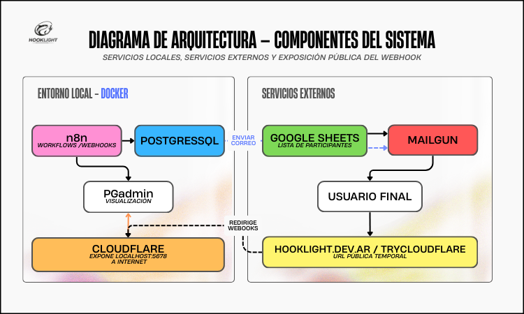
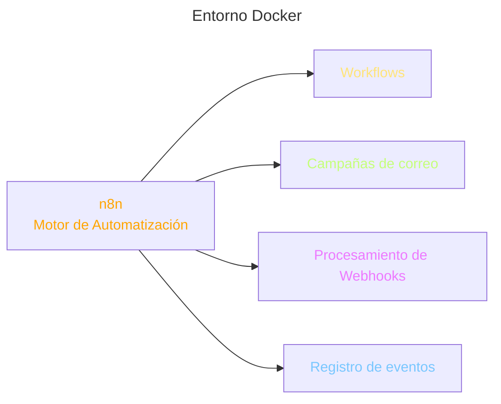
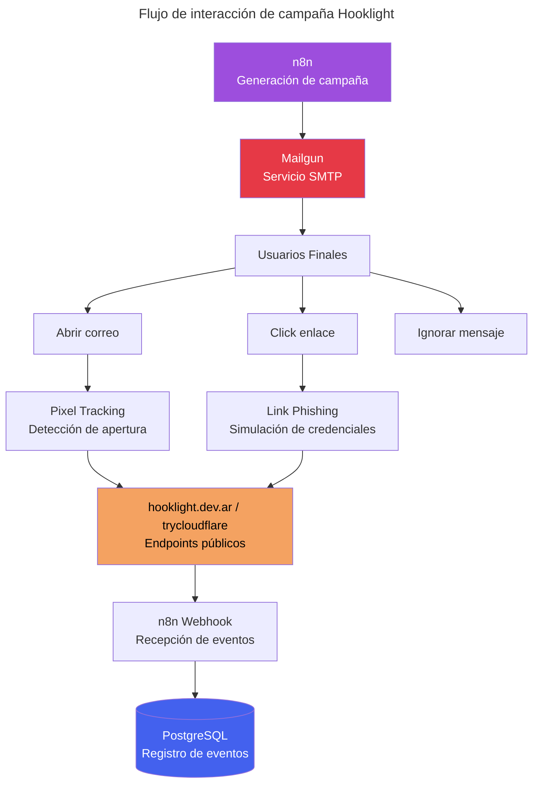
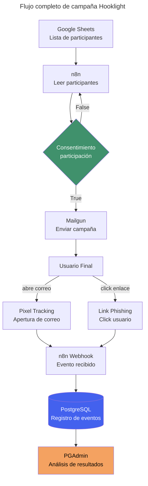

# Diagrama de Arquitectura

### Arquitectura del sistema Hooklight

El sistema Hooklight está diseñado para automatizar campañas simuladas de phishing con fines educativos, registrando la interacción de los usuarios para posteriormente generar métricas y capacitación.

La arquitectura se divide en dos grandes bloques:

Entorno local (Docker)

## Servicios externos

Esta separación permite mantener el control del sistema localmente mientras se utilizan servicios externos para el envío de correos y la gestión de participantes.

### 1. Entorno Local — Docker

Este bloque contiene los componentes principales que ejecutan la lógica del sistema.

+ n8n — Motor de automatización

+ n8n es el orquestador del sistema.

+ Se encarga de:

+ ejecutar workflows de automatización

+ enviar correos de campaña

+ registrar eventos

+ procesar webhooks

### Los workflows principales incluyen:

+ envío de campañas de phishing

+ registro de apertura de correos

+ registro de clics en enlaces

+ PostgreSQL — Base de datos

+ PostgreSQL almacena los eventos generados durante las campañas.

#### Entre los datos registrados se encuentran:

+ email del participante

+ tipo de evento (open / click)

+ fecha y hora

+ dirección IP

+ user-agent

+ país aproximado

#### Esto permite posteriormente analizar el comportamiento de los usuarios durante la simulación.

+ PGAdmin — Visualización de base de datos

 PGAdmin permite administrar y visualizar la base de datos PostgreSQL.

#### Se utiliza para:

+ inspeccionar los eventos registrados

+ analizar resultados de campañas

+ verificar el funcionamiento del sistema.

+ Cloudflare Tunnel

+ Cloudflare expone el servidor local a internet mediante un túnel seguro.

### Esto permite que los webhooks de n8n sean accesibles desde internet, sin necesidad de abrir puertos en la red local.

#### Su función principal es:

+ exponer localhost:5678

+ permitir que los enlaces de phishing funcionen externamente

+ recibir eventos de interacción de usuarios.

## 2. Servicios Externos

Este bloque contiene los servicios que interactúan con el sistema desde internet.

+ Google Sheets — Lista de participantes

+ Google Sheets funciona como fuente de datos para las campañas.

#### Contiene información como:

+ nombres

+ correos electrónicos

+ identificadores de campaña

+ n8n consulta esta hoja para obtener los destinatarios de los correos.

+ Mailgun — Envío de correos

#### Mailgun es el servicio SMTP encargado de enviar los correos de phishing simulados.

#### Flujo:

---
+ n8n genera la campaña

+ se envía a Mailgun

+ Mailgun distribuye los correos a los usuarios

+ Esto permite enviar correos de forma masiva y controlada.

+ Usuario Final

+ Es el destinatario de la simulación.

+ El usuario puede realizar tres acciones principales:

+ abrir el correo

+ hacer clic en el enlace

+ ignorar el mensaje

+ Cada interacción genera un evento registrado por el sistema.

+ Dominio público (hooklight.dev.ar / trycloudflare)

+ El dominio público expone los endpoints que reciben las interacciones del usuario.

+ Estos endpoints incluyen:

+ pixel de tracking para detectar aperturas

+ enlaces de phishing simulados

+ Cuando el usuario interactúa con ellos, se envían eventos al sistema.

## 3. Flujo completo del sistema

#### El funcionamiento general del sistema es el siguiente:

+ Los participantes se cargan en Google Sheets

+ n8n lee la lista de participantes

+ n8n envía correos a través de Mailgun

+ El usuario recibe el correo de phishing simulado

+ Si abre el correo o hace clic en el enlace

+ se activa un webhook expuesto por Cloudflare

+ n8n registra el evento en PostgreSQL

+ Los resultados pueden analizarse desde PGAdmin

### Objetivo del sistema

#### La finalidad de esta arquitectura es permitir:

+ simulaciones controladas de phishing

+ registro de métricas de comportamiento

+ capacitación en ciberseguridad

+ concienciación sobre ingeniería social

---
## Temas Relacionados.
+ ###  [Ver Diagrama de Flujo](/Docs/flujo.md)
+ ###  [Investigacion sobre pishing](/Docs/Investigacion.md)
+ ###  [Sobre el Proyecto](/Docs/proyecto.md)
+ ###  [Regresar al menu principal](/README.md)