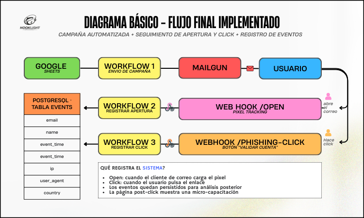
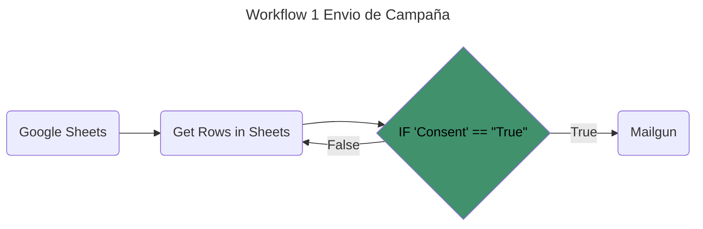
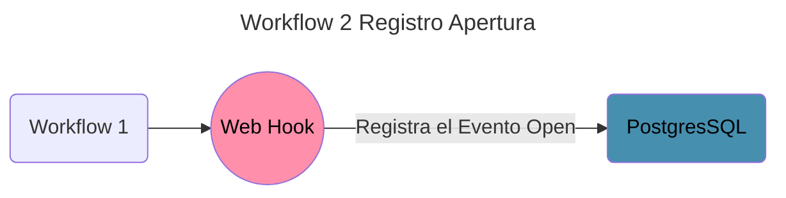

# Diagrama de flujo de trabajo del sistema

El workflow en conjunto empieza desde un formulario de consentimiento , el cual es procesado por el workflow 1

### 🟡 Workflow 1
---

---

El __workflow 1__ recibe un csv o sheets con la lista de los participantes , el cual es procesado dentro de n8n para extraer las filas de los participantes , estas filas son enviadas a un nodo if el cual solo pasa al nodo de mailgun aquellos participantes cuya columna __"consentimiento" == True__ , si no es true pasa al siguiente. Una vez enviado el Mail mediante mailgun , el workflow 2 se activa y queda en escucha , este workflow 2 se activa solo si se abre el correo

### 🟡 Workflow 2
---

---

Una vez abierto el correo mediante un webHook capturamos los datos del usuario como mail , horario en que lo abrio y su nombre. con esto obtenemos la data __open__ que nos servira para hacer nuestra futura metricas , si ademas de esto el usuario decide hacer click en el correo **pishing** se activará el __workflow 3__

### 🟡 Workflow 3
---

---

El __workflow 3__ tiene como objetivo activarse si el usuario decide darle click al enlace del correo , con esto se activa un webHook que registra el __evento Click__ , tambien se obtienen los datos anteriormente mencionado , esta metrica sirve para usarla con la metrica __open__ , significa , de los que abrieron el mail , cuantos le hicieron click. Finalmente se registra en una base de datos postgresSQL

## Temas Relacionados.
+ ###  [Ver Diagrama de Arquitectura](/Docs/arquitectura.md)
+ ###  [Investigacion sobre pishing](/Docs/Investigacion.md)
+ ###  [Sobre el Proyecto](/Docs/proyecto.md)
+ ###  [Regresar al menu principal](/README.md)