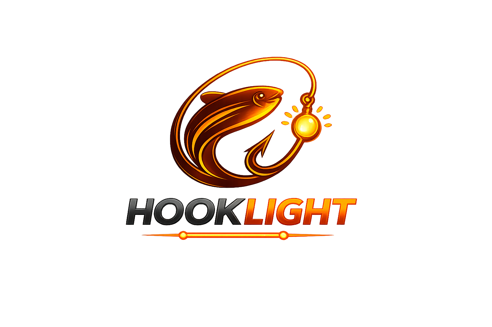

# TESIS HOOKLIGHT

Nos presentamos somo **HookLight**:
- ⭐ Mestre Francisco
- ⭐ Molina Martina
- ⭐ Sponton Giani

### Simulación Automatizada de Campañas de Phishing para Concientización en Ciberseguridad

Presentamos el tema 2 un Sistema diseñado para simular campañas de phishing de manera controlada y ética, con el objetivo de medir la vulnerabilidad humana frente a ataques de ingeniería social y mejorar la concientización en ciberseguridad. Nuestro sistema permite crear simulaciones de pishing que te permiten capacitar  a tu personal para este tipo de ataque , mediante una base de datos de participantes , se envia un mail malicioso que pone a prueba al usuario , en caso de que el usuario caiga o desestime el mail , el html del correo mediante **webhooks** envia metricas que son analizadas y plasmadas en **Grafana**. Hay más que explicar puedes navegar en nuestro indice de aqui abajo 👇.

## 📒 INDICE
+ ###  [📗 Sobre el Proyecto](/Docs/proyecto.md)

+ ###  [📕 Investigacion sobre pishing](/Docs/Investigacion.md)

+ ###  [📘 Ver Diagrama de Flujo](/Docs/flujo.md)

+ ###  [📘 Ver Diagrama de Arquitectura](/Docs/arquitectura.md)

+ ###  [📙 Documento de avances 1](/Docs/Documentacion_avance_tesis_Hooklight.pdf)

---
